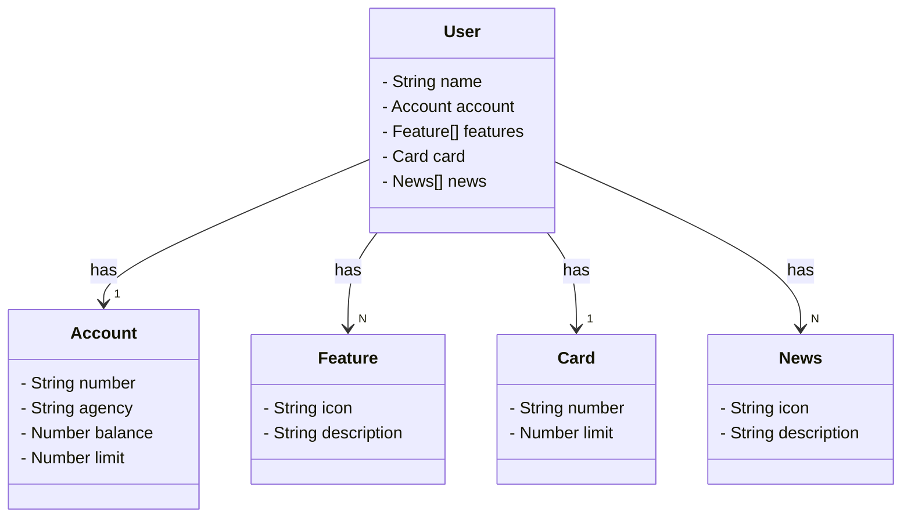

# Santander Dev week 2023

Java Restful API

## Diagrama de Classes

```mermaid
classDiagram
    class User {
        - String name
        - Account account
        - Feature[] features
        - Card card
        - News[] news
    }
    
    class Account {
        - String number
        - String agency
        - Number balance
        - Number limit
    }

    class Feature {
        - String icon
        - String description
    }

    class Card {
        - String number
        - Number limit
    }

    class News {
        - String icon
        - String description
    }

    User --> "1" Account : has
    User --> "N" Feature : has
    User --> "1" Card : has
    User --> "N" News : has
```
